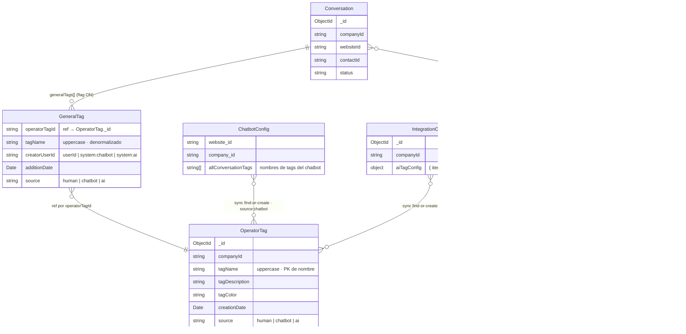
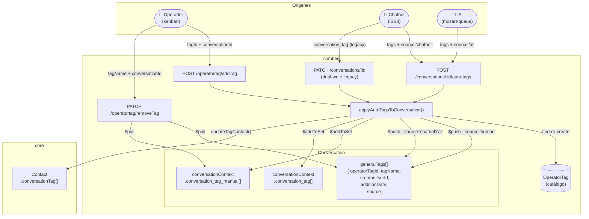
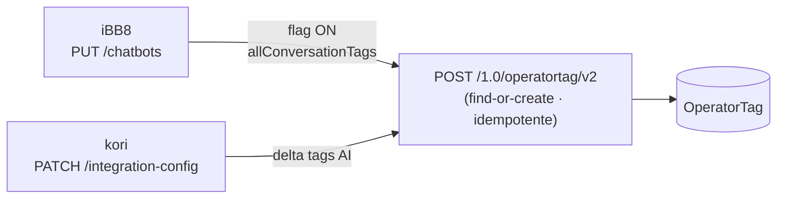

# Modelo de datos — Tags de conversación (flag ON)

> Feature flag: `feature.combee.general-tags`  
> Refs: roadmap#277, combee#827, iBB8#1498, kanban#297, kori#60, mozart-queue#190

---

## Entidades y relaciones

---

## Flujos de escritura (flag ON)

---

## Sync del catálogo `OperatorTag`

---

## Campos por origen

| Origen | `creatorUserId` | `source` | Escribe legacy |
|--------|----------------|----------|----------------|
| Operador humano | userId del JWT | `human` | `conversation_tag_manual` (uppercase) |
| Chatbot / iBB8 | userId del JWT → `system:chatbot` si no hay user | `chatbot` | `conversation_tag` (lowercase) |
| iBB8 campaña HSM | `system:chatbot` | `chatbot` | `conversation_tag` (lowercase) |
| IA / mozart-queue | `system:ai` | `ai` | `conversation_tag` (lowercase) |

---

## Notas

- Ausencia de `source` en un `GeneralTag` existente → se interpreta como `human`.
